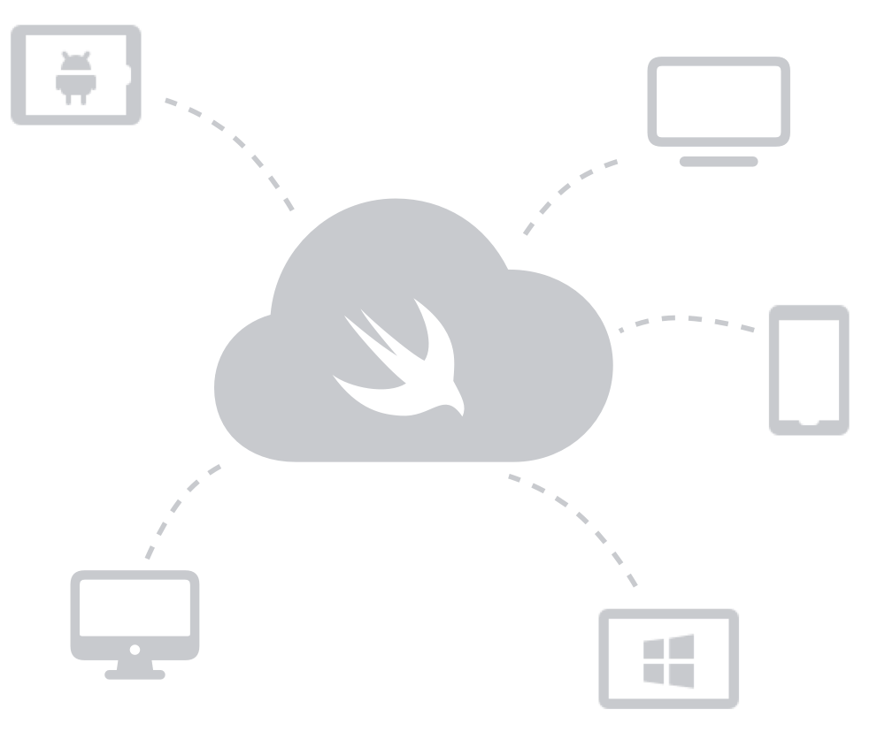

### SwiftWeb
**Run Your SwiftUI App on a Swift Server.** 
**Serve Many Clients with Your SwiftUI Web App.**

---

With **SwarmUI**, you can easily provide a web interface to your existing SwiftUI app. SwarmUI renders SwiftUI code to HTML and CSS and keeps a WebSocket connection to connected Browsers. User input events are sent to your Swift server which runs your application logic. Screen updates are sent back to connected clients.

## Requirements

The SwiftWeb framework is intentionally kept independant of any HTTP / WebSocket server implementation. In order to provide a user interface over the web, you need to provide the static 

## Usage

The SwiftWeb framework is intentionally kept independant of 

## Contributing
Contributions to this projects are welcome. Please make sure to read the [contribution guidelines](https://github.com/Apodini/.github/blob/master/CONTRIBUTING.md) first.

## License
This project is licensed under the MIT License. See [License](https://github.com/Apodini/Template-Repository/blob/master/LICENSE) for more information.

